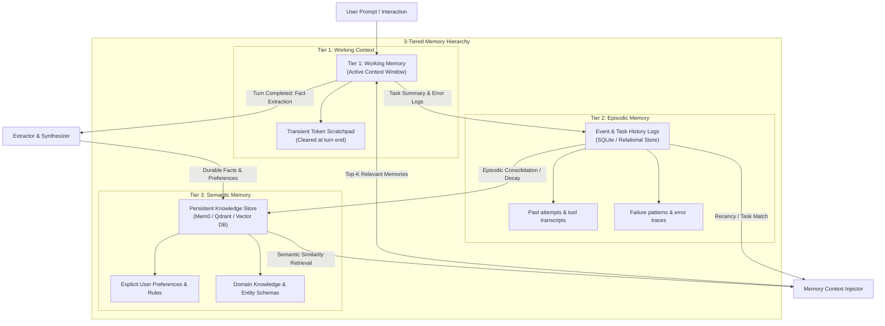

# Agent Memory Architect & Context Engine

Guides the design and maintenance of long-term, multi-tiered agent memory systems. Allows agents to retain user preferences, domain knowledge, and past project history across sessions without overwhelming the LLM's context window.

## When to Use This Skill
- When building AI agents that require state and memory across multiple days or conversations.
- When selecting or configuring memory frameworks (`Mem0`, `Cognee`, `Zep`, vector databases).
- When designing semantic search, fact extraction, and memory decay/summarization algorithms.
- When protecting an agent's memory store from memory poisoning or conflicting obsolete facts.
- Trigger phrases: `"agent memory"`, `"persistent memory"`, `"Mem0 integration"`, `"remember user preferences"`, `"episodic memory"`.

---

## The 3-Tiered Memory Architecture



### Memory Tier Breakdown

| Memory Tier | Storage Backend | Durability | Content & Scope |
| :--- | :--- | :--- | :--- |
| **Tier 1: Working Memory** | LLM Context Window | Single Turn / Task | Active system prompt, immediate user input, scratchpad tokens. Cleared when turn concludes. |
| **Tier 2: Episodic Memory** | SQLite / Document DB | Session / Project | Task histories, past execution failures, what was previously attempted. |
| **Tier 3: Semantic Memory** | Vector Store (Mem0/Qdrant) | Cross-Session Persistent | Durable user habits, domain rules, extracted facts, and entity graphs. |

---

## Step-by-Step Memory Implementation

### Step 1: Fact Extraction & Memory Ingestion
After each completed conversation or major milestone, run an extraction prompt to distill durable facts from transient chat filler:
```python
extraction_prompt = """
Extract durable facts, explicit user preferences, and architectural decisions
from the following conversation. Ignore temporary greetings and transient errors.
Output as a list of concise declarative statements.
"""
```

### Step 2: Semantic Memory Storage (Mem0 / Vector Store)
Store facts with metadata (timestamp, source session, category):
```python
from mem0 import Memory

# Initialize Memory Engine
memory = Memory()

# Add user fact
memory.add(
    "User prefers TypeScript over JavaScript and uses strict null checks",
    user_id="developer_123",
    metadata={"category": "coding_style", "confidence": 0.95}
)
```

### Step 3: Dynamic Context-Aware Retrieval
At the beginning of each turn, query the memory store using the user's active prompt:
```python
relevant_memories = memory.search(query=user_prompt, user_id="developer_123", limit=5)

# Inject only relevant facts into system prompt (Mem0 returns 'memory' key)
memory_context = "\n".join([f"- {m.get('memory', m.get('text', ''))}" for m in relevant_memories])
system_prompt = f"Relevant User Context:\n{memory_context}\n\nTask: ..."
```

### Step 4: Conflict Resolution & Memory De-Duplication
- **Detect Conflicting State**: If a new memory says "User switched database from Postgres to SQLite", flag and archive the older contradictory memory.
- **Memory Decay**: Gradually de-prioritize or archive facts that have not been retrieved or reinforced over $N$ interactions.

## Anti-Patterns & Traps to Avoid

1. **Memory Store Poisoning**: Ingesting unvetted user inputs or scraped web content directly into long-term semantic memory. An adversary can inject persistent jailbreak instructions that automatically load into future sessions. Always sanitize facts before ingestion.
2. **Ghost Fact Collisions**: Storing new facts without invalidating contradictory legacy facts (e.g., "User uses PostgreSQL" vs "User migrated to SQLite"). Always implement conflict detection to archive superseded entries.
3. **Context Window Flooding**: Ingesting dozens of memory snippets on every prompt. Cap retrieval to top 3–5 high-confidence facts to avoid diluting system prompt attention.
4. **Storing Raw Chat Transcripts Instead of Atomic Propositions**: Dumping conversational filler ("Hello", "Sounds good") into vector storage rather than distilling declarative atomic statements.

---

## Quality Checklist

- [ ] Ingested memories are distilled declarative statements, not raw conversation transcripts.
- [ ] Memory retrieval is strictly bounded to top 3–5 items per turn to preserve context tokens.
- [ ] Contradictory memories are flagged and legacy facts archived by recency timestamp.
- [ ] Memory poisoning defenses are active: external untrusted content is never written to long-term memory without sanitization.
- [ ] Memory decay or TTL policies are defined for ephemeral episodic task logs.
- [ ] PII, passwords, and sensitive API keys are stripped prior to vector store persistence.
