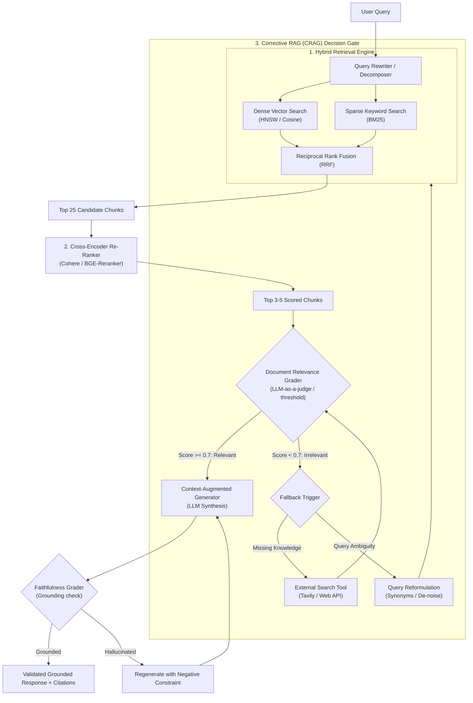

# Agentic RAG Engineer & Advanced Retrieval

A production engineering skill for building intelligent, self-correcting Retrieval-Augmented Generation (RAG) pipelines that eliminate retrieval hallucinations, irrelevant context, and missed answers.

## When to Use This Skill
- When standard naive vector search returns irrelevant or incomplete chunks.
- When designing semantic search across complex documentation, codebases, or manuals.
- When implementing **Self-RAG** (retrieval on demand with reflection) or **Corrective RAG (CRAG)**.
- When configuring hybrid search (Vector + BM25 keyword) and cross-encoder re-ranking.
- Trigger phrases: `"build RAG"`, `"improve retrieval"`, `"semantic chunking"`, `"hybrid search"`, `"reranking"`, `"RAG pipeline"`.

---

## Modern RAG Architecture & Self-Corrective Loop



1. **Semantic Chunking**: Split text by proposition or natural heading boundaries, not arbitrary character slices.
2. **Hybrid Retrieval**: Combine dense semantic embeddings (`text-embedding-3`, `bge-large`) with sparse keyword matching (`BM25`) to capture both abstract meaning and exact identifiers.
3. **Cross-Encoder Re-ranking**: Score the top 25 candidates using a full cross-encoder (`Cohere Rerank`, `BGE-Reranker`), retaining only the top 3–5 highest-confidence chunks.
4. **Corrective RAG (CRAG)**: If retrieved documents fail the relevance threshold, automatically reformulate the query or trigger tool fallback before generation.

---

## Step-by-Step Implementation Workflow

### Step 1: Ingestion & Semantic Chunking
```python
from langchain_experimental.text_splitter import SemanticChunker
from langchain_openai.embeddings import OpenAIEmbeddings

# Initialize Semantic Chunker
text_splitter = SemanticChunker(
    OpenAIEmbeddings(),
    breakpoint_threshold_type="percentile"
)

docs = text_splitter.create_documents([raw_documentation_text])
```

### Step 2: Hybrid Search (Dense + Sparse with RRF)
```python
# Query both Dense Vector Store and BM25 Index
dense_hits = vector_db.similarity_search(query, k=25)
bm25_hits = bm25_retriever.get_relevant_documents(query, k=25)

# Combine using Reciprocal Rank Fusion (RRF)
# Score = sum(1 / (60 + rank_i))
```

### Step 3: Cross-Encoder Re-Ranking
Filter down 50 rough candidates to the 5 highest-signal context passages:
```python
import cohere
co = cohere.Client(api_key="...")

response = co.rerank(
    model="rerank-english-v3.0",  # or 'rerank-multilingual-v3.0'
    query=query,
    documents=[doc.page_content for doc in candidates],
    top_n=5
)
filtered_context = [candidates[r.index] for r in response.results if r.relevance_score > 0.6]
```

### Step 4: Grounded Answer Generation with Citations
Inject filtered chunks into the generation prompt and enforce inline brackets citations (`[Doc 1, Section 2.3]`).

## Anti-Patterns & Traps to Avoid

1. **Fixed-Token Naive Chunking**: Slicing documents at arbitrary 500-character boundaries. This routinely bifurcates markdown tables, function blocks, or bullet lists across chunks, destroying retrieval context. Use semantic or Markdown-aware chunkers.
2. **Dense-Only Retrieval for Exact Identifiers**: Relying exclusively on vector similarity for product SKUs, error codes, UUIDs, or function names. Dense models frequently hallucinate nearest semantic neighbors for exact alphanumerics; always pair dense vectors with BM25 keyword search.
3. **"Lost in the Middle" Context Flooding**: Stuffing 25+ retrieved chunks into the generation prompt. LLMs exhibit severe recall degradation in the middle of long contexts. Always apply a cross-encoder to filter down to the top 3–5 highest-relevance passages.
4. **Ungrounded Output Without Inline Citations**: Permitting the model to synthesize answers without citing source chunk brackets (`[Doc 2, p. 14]`). Without citations, hallucinated interpolations cannot be verified.

---

## Quality Checklist

- [ ] Chunking respects semantic boundaries (markdown headers, code blocks, tables preserved intact).
- [ ] Hybrid retrieval unifies dense vectors and sparse BM25 via Reciprocal Rank Fusion (RRF).
- [ ] Cross-encoder re-ranking filters candidate pools down to top 3–5 passages with explicit score thresholds ($\ge 0.6$).
- [ ] Self-corrective fallback triggers web search or query reformulation when retrieved relevance is low.
- [ ] Generation prompt strictly enforces bracketed inline citations tied to source document IDs.
- [ ] Hallucination / faithfulness grading verifies that all claims in the response originate from the context chunks.
