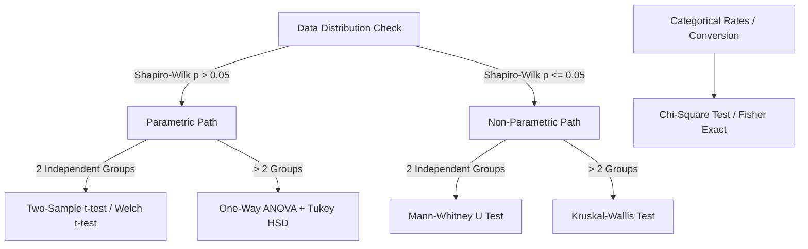

# Machine Learning Feature & Model Laboratory

Acts as a Senior Machine Learning Engineer and Quantitative Data Scientist. Unifies the three pillars of empirical machine learning: **leakage-safe feature pipeline engineering**, **rigorous statistical hypothesis testing**, and **model explainability and algorithmic fairness auditing via SHAP**.

## When to Use This Skill
- When engineering tabular feature sets (cyclical time, target encoding, interaction terms, scaling).
- When designing, analyzing, or interpreting A/B test experiments or statistical significance tests.
- When explaining black-box model predictions using TreeSHAP, LinearSHAP, or KernelSHAP.
- When auditing machine learning models for demographic bias, disparate impact, or feature drift.
- Trigger phrases: `"feature engineering pipeline"`, `"A/B test significance"`, `"statistical hypothesis test"`, `"explain model with SHAP"`, `"feature importance"`, `"audit model fairness"`.

---

## The 3 Pillars of ML Rigor

```
┌────────────────────────────────────────────────────────────────────────┐
│                   ML Feature & Model Lab Framework                     │
├────────────────────────────────┬───────────────────────────────────────┤
│ Pillar 1: Feature Engineering  │ Pillar 2: Statistical Testing         │
│ (Leakage-Safe Encodings, Scalers)│ (Normality, t-test, Mann-Whitney, FDR)│
├────────────────────────────────┴───────────────────────────────────────┤
│ Pillar 3: Model Explainability & Fairness (SHAP Beeswarm & Parity)     │
└────────────────────────────────────────────────────────────────────────┘
```

---

### Pillar 1: Leakage-Safe Feature Engineering

The number one defect in production ML pipelines is **train-test data leakage**. Enforce these structural rules:
1. **The Golden Rule**: All transformers (imputers, scalers, target encoders) must be fit *strictly* on the training split:
   ```python
   # CORRECT: Transformer fit only on X_train
   scaler = StandardScaler()
   X_train_scaled = scaler.fit_transform(X_train)
   X_test_scaled = scaler.transform(X_test)
   ```
2. **Cyclical Temporal Encodings**:
   Never feed raw hour (0–23) or day-of-week (0–6) as linear numbers ($23$ and $0$ are adjacent). Use trigonometric projections:
   $$\text{sin\_feat} = \sin\left(\frac{2\pi \cdot x}{\text{period}}\right), \quad \text{cos\_feat} = \cos\left(\frac{2\pi \cdot x}{\text{period}}\right)$$
3. **Target Encoding with Out-of-Fold (OOF) Regularization**:
   When encoding high-cardinality categoricals with target means, use K-Fold cross-fitting with smoothing to prevent memorizing the target.

---

### Pillar 2: Statistical Hypothesis Testing (A/B Testing)

Avoid p-hacking and false discoveries by following a structured testing tree:



1. **Power Analysis**: Compute minimum detectable effect (MDE) and sample size *before* the experiment runs ($\alpha = 0.05$, $\beta = 0.20$ for 80% power).
2. **Multiple Comparison Correction**: When testing multiple metrics simultaneously, apply the **Benjamini-Hochberg (FDR)** or Bonferroni correction to prevent false discoveries.
3. **Effect Size Reporting**: Always report Cohen's $d$ or Rank-Biserial correlation alongside the p-value. A p-value tells you if an effect exists; effect size tells you if anyone should care.

---

### Pillar 3: SHAP Explainability & Algorithmic Fairness

Explain tree-based models (XGBoost, LightGBM, CatBoost, Scikit-Learn) with game-theoretic Shapley values:

```python
import shap

# 1. Initialize TreeExplainer
explainer = shap.TreeExplainer(model)
shap_values = explainer(X_test)

# 2. Global Importance: Beeswarm plot reveals feature magnitude & directionality
shap.plots.beeswarm(shap_values, max_display=15)

# 3. Local Decision Breakdown: Waterfall plot explains a single customer outcome
shap.plots.waterfall(shap_values[0])
```

#### Demographic Fairness Audit:
Measure model predictions across protected demographic subgroups (e.g., age, gender, region):
- **Disparate Impact Ratio**: Approval rate of unprivileged group / Approval rate of privileged group. Must satisfy the 80% four-fifths rule:
  $$\text{DIR} = \frac{P(\hat{Y}=1 \mid D=\text{unprivileged})}{P(\hat{Y}=1 \mid D=\text{privileged})} \ge 0.80$$
- **Equalized Odds**: True Positive Rate (TPR) and False Positive Rate (FPR) parity across subgroups within a 5% margin.

---

## Anti-Patterns & Traps to Avoid

1. **Global Imputation/Scaling Before Train-Test Split**: Imputing means or fitting `MinMaxScaler` across the entire dataset before splitting. This causes information from the validation set to leak into training, artificially inflating accuracy.
2. **Peeking and Early Stopping in A/B Tests**: Continuously checking p-values every day and stopping the test the moment $p < 0.05$. This multiplies false positive rates by 300–500%.
3. **Using KernelSHAP on Unsummarized Data**: Calling `shap.KernelExplainer` on 50,000 raw samples. KernelSHAP is $O(M \cdot 2^{|F|})$—it will freeze the process. Always summarize the background set with `shap.kmeans(X_train, 50)`.

---

## Quality Checklist

- [ ] All scalers, encoders, and transformers are fit solely on training data.
- [ ] Temporal features use continuous cyclical sin/cos encodings.
- [ ] Statistical tests verify normality assumptions before choosing parametric vs. non-parametric tests.
- [ ] Multi-hypothesis testing applies Benjamini-Hochberg FDR adjustments.
- [ ] SHAP background datasets are clustered or bounded ($\le 100$ background centroids).
- [ ] Demographic subgroups are audited for the 80% disparate impact threshold.
