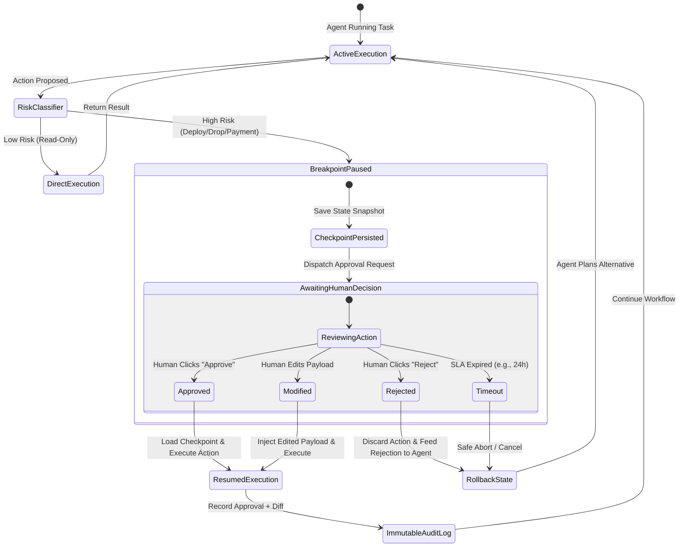

# Human-in-the-Loop (HITL) Governor & Policy Gate

Ensures enterprise safety, regulatory compliance, and operational control by intercepting high-risk agent operations and enforcing explicit human approvals, state checkpoints, and immutable audit logs.

## When to Use This Skill
- When an agent is about to execute a destructive or irreversible action:
  - Database mutations (`DROP`, `DELETE`, migration scripts).
  - Financial operations (initiating payments, modifying billing tiers).
  - Infrastructure changes (cloud resource provisioning, deploying to production).
  - External communication (broadcasting emails, publishing social posts).
- When designing workflow state machines with pause/resume requirements.
- Trigger phrases: `"human in the loop"`, `"approval gate"`, `"require user confirmation"`, `"safe execution policy"`, `"checkpoint agent"`.

---

## Execution Lifecycle & Risk Classification



### Risk Tiers & Control Gates

| Tier Level | Action Category | Required Control Gate |
| :--- | :--- | :--- |
| 🟢 **Tier 1: Low** | Read-Only (Fetch, Search, Read, Profiling) | Fully Autonomous |
| 🟡 **Tier 2: Medium** | Staging Writes (Scratch files, Draft PRs) | Automated Notification / Event Log |
| 🔴 **Tier 3: High** | Destructive / Production Ops (Deploy, Drop, Payments) | Hard Breakpoint & Human Approval Required |

---

## HITL Implementation Patterns

### 1. State Checkpointing & Interrupts (LangGraph Pattern)
Before dispatching a high-risk tool node, interrupt the execution graph and persist state:
```python
from langgraph.checkpoint.sqlite import SqliteSaver
from langgraph.graph import StateGraph

# Configure checkpointer
memory = SqliteSaver.from_conn_string(":memory:")

# Interrupt before the production deploy node
workflow.compile(
    checkpointer=memory,
    interrupt_before=["deploy_to_production_node"]
)
```

### 2. The Approval Request Envelope
When pausing execution, present a structured approval request to the human operator:

```markdown
### ⚠️ Human Approval Required: [Operation Name]

**Risk Level**: 🔴 High (Tier 3)
**Action**: Deploying commit `7a81c2` to production cluster `us-east-1`.
**Estimated Blast Radius**: Affects 12,000 active web sessions.

#### Proposed Payload / Diff:
```diff
- IMAGE_TAG=v1.4.2
+ IMAGE_TAG=v1.5.0
```

#### Verification Steps Completed by Agent:
- [x] All 84 unit and integration tests passed.
- [x] Staging smoke tests green.
- [x] Database migration dry-run completed with zero data loss.

**Decision Required**: Please confirm with `APPROVE` or reject with `REJECT: [Reason]`.
```

### 3. Signed Audit Logging
Record every human decision with metadata:
- Timestamp, user identity, action hash, and agent rationale.
- Never proceed if the human response is ambiguous; require explicit confirmation.

## Anti-Patterns & Traps to Avoid

1. **Silent Partial Execution**: Executing preliminary mutations (e.g., dropping an index or allocating cloud spend) *before* requesting approval for the overall operation. If the human rejects, the environment is left in a dirty, inconsistent state. High-risk operations must be all-or-nothing transactions.
2. **Ambiguous Affirmation Parsing**: Interpreting ambiguous conversational feedback (e.g., "Sounds plausible", "Go on", "Looks okay") as legally binding authorization for Tier 3 production actions. Require explicit confirmation tokens or exact keywords (`APPROVE` / `CONFIRM`).
3. **Approval Fatigue Triggering**: Subjecting operators to approval popups for harmless Tier 1 read operations. Excessive friction causes human operators to blindly rubber-stamp alerts, defeating the purpose of governance.
4. **Indefinite Lock Holding During Pauses**: Halting at a breakpoint while holding open database transactions, row-level locks, or unreleased mutexes. State must be serialized to an external checkpointer and connection pools released before entering the waiting state.

---

## Quality Checklist

- [ ] Tier 3 tools strictly require an explicit confirmation token and cannot execute autonomously.
- [ ] State snapshot is fully persisted to a reliable checkpointer (e.g. SQLite/Redis) before pausing.
- [ ] Database locks, open transactions, and network connections are released during the pause state.
- [ ] The approval envelope clearly displays: (1) Operation, (2) Blast radius, and (3) Reversible diff.
- [ ] Human rejections trigger an automated rollback and clean up temporary staging artifacts.
- [ ] Every approval and rejection is recorded in an immutable audit log with user identity and timestamp.
