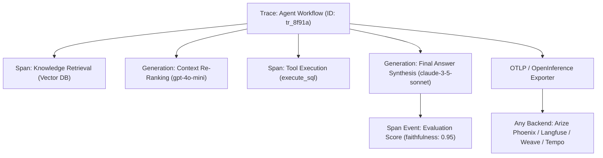

# LLM Observability & Distributed Agent Tracing

A vendor-neutral telemetry skill for instrumenting LLM applications, multi-agent swarms, and RAG pipelines using **OpenTelemetry GenAI Semantic Conventions** and **OpenInference**.

---

## When to Use This Skill

- Instrumenting multi-agent workflows with end-to-end distributed tracing across steps and tools.
- Capturing hierarchical call trees: Agent Reasoning $\rightarrow$ Tool Execution $\rightarrow$ Vector Retrieval $\rightarrow$ LLM Generation.
- Tracking token economics (input/output tokens, dollar cost) across model providers.
- Measuring Golden Signals: **Time to First Token (TTFT)**, **Throughput** (tokens/sec), and **Latency breakdowns**.
- Redacting PII (emails, SSNs, credit cards) before traces are exported to log collectors.
- Logging evaluation scores (faithfulness, hallucination, user ratings) directly attached to trace IDs.

---

## Core Architecture: Hierarchical Tracing Model



### Standard GenAI Semantic Conventions Attributes

| Attribute Name | Type | Description / Example |
| :--- | :--- | :--- |
| `gen_ai.system` | `string` | Provider identifier (`openai`, `anthropic`, `google`, `ollama`) |
| `gen_ai.request.model` | `string` | Requested model name (`gpt-4o`, `claude-3-5-sonnet`) |
| `gen_ai.usage.prompt_tokens` | `int` | Prompt / input token count (`420`) |
| `gen_ai.usage.completion_tokens` | `int` | Completion / output token count (`180`) |
| `gen_ai.usage.cost_usd` | `double` | Calculated USD cost based on model pricing |
| `openinference.span.kind` | `string` | `AGENT`, `CHAIN`, `LLM`, `TOOL`, `RETRIEVER`, `RERANKER` |

---

## Quickstart Integration Pattern

A complete, production-ready telemetry engine is available at [`scripts/telemetry_engine.py`](./scripts/telemetry_engine.py). 

Import and wrap your agent steps using standard context managers:

```python
from scripts.telemetry_engine import LLMObservabilityManager

telemetry = LLMObservabilityManager(service_name="agent-service", environment="production")

# 1. Trace the overall agent conversation / turn
with telemetry.trace_agent_workflow("research_agent", user_id="usr_102", session_id="sess_404"):
    
    # 2. Trace deterministic tool execution
    with telemetry.trace_tool_execution("web_search", {"query": "Q3 AI earnings"}) as tool_rec:
        tool_rec["output"] = "Retrieved 3 financial news sources..."

    # 3. Trace LLM generation with token counts and latency
    with telemetry.trace_llm_generation(
        span_name="synthesize_findings",
        model="gpt-4o",
        user_prompt="Summarize the earnings report."
    ) as llm_rec:
        # LLM call happens here
        llm_rec["completion"] = "Tech earnings rose 14% year-over-year..."
        llm_rec["prompt_tokens"] = 450
        llm_rec["completion_tokens"] = 120
        llm_rec["ttft_seconds"] = 0.38
```

---

## Zero-Code Backend Configuration

Telemetry exports via standard OpenTelemetry OTLP protocol. Change destinations simply by setting environment variables—no code changes required:

| Observability Backend | Required Environment Variables |
| :--- | :--- |
| **Arize Phoenix (Local / Self-Hosted)** | `OTEL_EXPORTER_OTLP_ENDPOINT="http://localhost:4317"`<br>`OTEL_EXPORTER_OTLP_PROTOCOL="grpc"` |
| **Langfuse (Cloud or Self-Hosted)** | `OTEL_EXPORTER_OTLP_ENDPOINT="https://us.cloud.langfuse.com/api/public/otel"`<br>`OTEL_EXPORTER_OTLP_HEADERS="Authorization=Basic <base64(pk:sk)>"` |
| **Weights & Biases Weave / Arize AI** | `OTEL_EXPORTER_OTLP_ENDPOINT="https://otlp.arize.com/v1"`<br>`OTEL_EXPORTER_OTLP_HEADERS="space_id=...,api_key=..."` |
| **Datadog / Grafana Tempo / Honeycomb** | `OTEL_EXPORTER_OTLP_ENDPOINT="http://otel-collector.internal:4317"` |

---

## Bundled Helper Assets

- [`scripts/telemetry_engine.py`](./scripts/telemetry_engine.py): Standalone, typed telemetry manager with PII regex redaction, pricing calculation for OpenAI/Anthropic/Gemini, and evaluation score attachment.

---

## Anti-Patterns & Traps to Avoid

1. **Synchronous Span Exporting on the Hot Path**: Calling trace export endpoints synchronously in the main execution thread. This adds 50–200ms of network overhead to every LLM turn. Always use asynchronous batching with `BatchSpanProcessor`.
2. **Vendor SDK Lock-in in Core Domain Logic**: Littering business logic with proprietary vendor decorators (`@observe`, `langfuse.trace()`). Abstract telemetry around OpenTelemetry / OpenInference standards so collectors can be swapped via environment variables.
3. **Leaking Unredacted PII to Third-Party Dashboards**: Streaming raw user credit cards, API keys, or personal health information into centralized logging platforms. Apply deterministic regex masking before emitting span attributes.
4. **Ignoring Streaming Latency Signals (TTFT)**: Measuring only total end-to-end duration while ignoring Time to First Token (TTFT). Users perceive streaming responsiveness based on TTFT; failure to capture chunk arrival times blinds you to streaming proxy stalls.

---

## Quality Checklist

- [ ] Telemetry conforms to **OpenTelemetry GenAI Semantic Conventions** and **OpenInference**.
- [ ] No vendor lock-in: collector target is swappable via `OTEL_EXPORTER_OTLP_ENDPOINT`.
- [ ] Traces capture full hierarchy: Agent Workflow $\rightarrow$ Tool Execution $\rightarrow$ Model Generation.
- [ ] Token usage (`prompt_tokens`, `completion_tokens`) and USD costs are recorded per span.
- [ ] Latency signals are captured: Total Duration and Time to First Token (TTFT).
- [ ] Sensitive customer data (emails, credit cards, SSNs) is sanitized prior to export.
