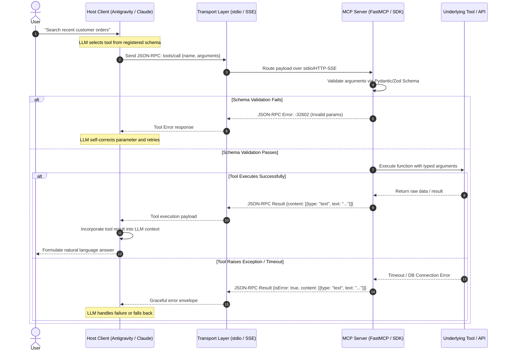

# MCP Tool Integrator & Protocol Engine

The definitive skill for implementing, configuring, and testing tools using Anthropic's open **Model Context Protocol (MCP)** and native function calling interfaces.

## When to Use This Skill
- When building custom MCP servers in TypeScript or Python.
- When exposing local files, databases, or third-party APIs to AI agents.
- When designing tool definitions (names, descriptions, parameter schemas) to maximize tool-calling accuracy.
- When diagnosing tool calling failures, hallucinated arguments, or JSON validation errors.
- Trigger phrases: `"build MCP server"`, `"create agent tool"`, `"tool calling"`, `"function calling schema"`, `"debug tool error"`.

## MCP Protocol Architecture & Execution Sequence



---

## The Anatomy of an MCP Tool

An MCP tool consists of three vital components:
1. **Name**: Clear, descriptive kebab-case or snake_case identifier (`query_database_records`).
2. **Description**: Concise explanation of what the tool does, when to call it, and formatting constraints.
3. **Input Schema**: Strictly typed JSON Schema generated via Pydantic or Zod with clear field descriptions.

---

## High-Reliability Tool Design Principles

### 1. Self-Documenting Parameter Schemas
Always include descriptions and enum constraints on every parameter:
```python
from pydantic import BaseModel, Field
from typing import Literal

class SearchDatabaseArgs(BaseModel):
    query: str = Field(
        description="The full-text search term to look for in article titles and bodies."
    )
    sort_order: Literal["asc", "desc"] = Field(
        default="desc",
        description="Chronological sort order of returned records."
    )
    limit: int = Field(
        default=10, ge=1, le=50,
        description="Maximum number of records to return (between 1 and 50)."
    )
```

### 2. Defensive Tool Execution & Error Envelopes
Never let tools crash with unhandled tracebacks. Return structured error objects so the agent can self-correct:
```python
def safe_tool_execution(func, *args, **kwargs):
    try:
        result = func(*args, **kwargs)
        return {"status": "success", "data": result}
    except ValueError as e:
        return {"status": "error", "message": f"Invalid argument: {str(e)}", "retryable": True}
    except Exception as e:
        return {"status": "error", "message": f"Fatal tool error: {str(e)}", "retryable": False}
```

### 3. Progressive Token Consumption
- If a tool query returns 5,000 rows, do not dump the raw response into the model's context.
- Implement pagination, summaries, and truncation with clear indicators: `"[Showing 10 of 450 results. Use offset=10 to view more]"`.

---

## Step-by-Step MCP Server Implementation (FastMCP Python)

```python
from mcp.server.fastmcp import FastMCP
from pydantic import BaseModel, Field

# Initialize FastMCP Server
mcp = FastMCP("DataService")

@mcp.tool()
def fetch_user_orders(user_id: str, status: str = "active") -> str:
    """
    Fetch a list of user orders filtered by status.
    Use this tool when the user asks for order history or active purchases.
    """
    # Deterministic query logic
    return f"Orders for {user_id} with status {status}..."

if __name__ == "__main__":
    mcp.run()
```

## Anti-Patterns & Traps to Avoid

1. **Missing Tool Execution Timeouts**: Permitting third-party API calls or database connections to hang indefinitely without a timeout. This locks the host agent process in an unrecoverable waiting state. Always enforce explicit execution timeouts (e.g., `timeout=15.0`).
2. **Dumping Raw Unhandled Tracebacks**: Allowing unhandled Python or Node exceptions to crash the JSON-RPC server or return opaque stack traces. Always catch exceptions and return a structured envelope (`{"status": "error", "message": "...", "retryable": True}`) so the model can self-correct.
3. **Context-Busting Payload Flooding**: Returning unpaginated multi-megabyte responses (e.g., thousands of raw database rows). Always truncate results, provide pagination metadata (`offset`, `limit`), and summarize large payloads.
4. **Underspecified Parameter Schemas**: Defining tools with vague names (`process_data`) and unconstrained arguments (`arg: str`). Without explicit field descriptions, regex patterns, or enums, models routinely hallucinate non-existent parameter values.

---

## Quality Checklist

- [ ] Every tool parameter has an explicit `description`, type constraint, and reasonable defaults.
- [ ] Numeric parameters enforce strict boundaries (`ge`, `le`) and strings use enums where appropriate.
- [ ] Tools enforce strict execution timeouts (10–30s max) to prevent agent hanging.
- [ ] Tool exceptions are caught and returned as actionable, structured error envelopes.
- [ ] High-volume query outputs are truncated or paginated with clear indicators for next page fetching.
- [ ] Destructive tools (write, delete, mutate) validate user permissions or require confirmation tokens.
