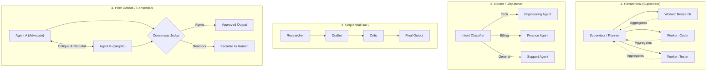

# Multi-Agent Orchestrator & Swarm Architect

A specialized architecture skill for designing, coordinating, and governing multi-agent systems. Enforces clean communication contracts, bounded recursion, and robust state coordination across agent swarms (e.g., LangGraph, CrewAI, AutoGen/AG2, Swarms).

## When to Use This Skill
- When designing systems with 2 or more specialized cooperating agents.
- When selecting an agent topology (Supervisor/Worker, Peer Debate, Router/Dispatcher, Sequential Pipeline).
- When debugging agent swarms stuck in infinite ping-pong loops or hallucinated delegating traps.
- When structuring shared state, checkpointing, and agent-to-agent (A2A) message protocols.
- Trigger phrases: `"multi-agent system"`, `"agent swarm"`, `"orchestrate agents"`, `"LangGraph workflow"`, `"CrewAI setup"`, `"agent collaboration"`.

## Core Multi-Agent Topologies



1. **Hierarchical (Supervisor/Workers)**: One planner coordinates worker subagents, aggregates results, and validates completion. Best for complex, multi-faceted projects.
2. **Router / Dispatcher**: Single classification node routes user intent to one specialized domain agent. Best for customer support and triage.
3. **Sequential Pipeline DAG**: Agent output feeds directly into the next agent's input as an assembly line. Best for content generation and code review gates.
4. **Peer Debate / Consensus**: Multiple agents independently solve a problem, critique each other, and vote on the final answer. Best for high-stakes mathematical or legal reasoning.

---

## The 4 Invariants of Safe Multi-Agent Systems

1. **Explicit Termination Guarantees**: Every multi-agent loop must have a hard `max_iterations` counter and a deterministic exit condition.
2. **Typed Shared State**: Shared state must use a validated schema (e.g., Pydantic model or TypedDict), not unvalidated free-form dictionaries.
3. **Bounded Delegation**: Prevent subagents from spawning infinite descendants. Cap delegation depth at 2 or 3 levels max.
4. **Isolated Memory Contexts**: Do not pass the entire conversation history to all subagents. Filter state to only what each worker needs to minimize context exhaustion and noise.

---

## Step-by-Step Orchestration Workflow

### Step 1: Define the Shared State Schema
```python
from typing import TypedDict, Annotated, List
import operator

class AgentState(TypedDict):
    task: str
    plan: List[str]
    research_notes: str
    draft_code: str
    # Use operator.add reducer so worker subagents append comments without overwriting
    review_comments: Annotated[List[str], operator.add]
    iteration_count: int
    is_approved: bool
```

### Step 2: Implement Nodes & Transitions
- Each node represents an isolated agent with a specific role, system prompt, and toolset.
- Transitions must be deterministic conditional edges:
  ```python
  def should_continue(state: AgentState) -> str:
      if state["is_approved"] or state["iteration_count"] >= 5:
          return "end"
      return "engineer"
  ```

### Step 3: Loop Prevention & Circuit Breakers
- If an agent generates the exact same tool call or output twice consecutively, trigger a circuit breaker and escalate to the supervisor.
- Log message traces between agents with correlation IDs for observability.

## Anti-Patterns & Traps to Avoid

1. **The Infinite Ping-Pong Trap**: Reviewer and Coder agents locked in an endless critique loop over stylistic nits. Always enforce a hard `max_iterations <= 5` and a deterministic consensus judge that breaks deadlocks.
2. **Context Window Contamination**: Blindly passing the full conversation transcript to all worker subagents. Filter the shared state to only the minimal input fields each worker requires.
3. **State Overwrite Race Conditions**: Appending to shared lists from concurrent worker nodes without an explicit reducer (e.g. `Annotated[List[str], operator.add]`), causing one worker's output to silently clobber another's.
4. **Unbounded Delegation Depth**: Allowing subagents to spawn child subagents indefinitely. Hard-cap delegation depth to 2 levels maximum.

---

## Quality Checklist

- [ ] Hard recursion and iteration limits are set on the graph runtime (`recursion_limit <= 25`, `max_iterations <= 5`).
- [ ] Shared state uses a strictly typed schema (`TypedDict` / Pydantic) with reducer annotations for list fields.
- [ ] Every multi-agent cycle has a deterministic exit condition that guarantees termination.
- [ ] Worker subagents receive filtered, role-specific context rather than full raw history.
- [ ] Repetitive tool calls trigger a circuit breaker that halts execution or escalates to human review.
- [ ] Correlation IDs are propagated across agent-to-agent message boundaries for tracing.
